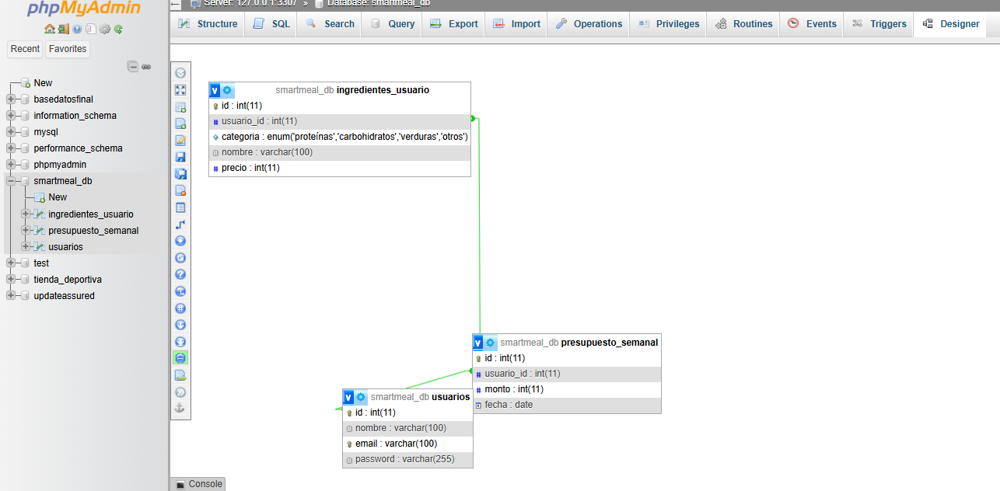

## Modelo de Datos

### Diagrama Entidad-Relación

### Diccionario de Datos

#### Tabla `usuarios`
| Campo | Tipo | Nulo | Clave | Descripción |
|-------|------|------|-------|-------------|
| id | INT | NO | PK | Identificador único del usuario |
| nombre | VARCHAR(100) | NO | - | Nombre completo del usuario |
| email | VARCHAR(100) | NO | UNIQUE | Correo electrónico (usado para login) |
| password | VARCHAR(255) | NO | - | Contraseña encriptada con bcrypt |
| created_at | TIMESTAMP | SÍ | - | Fecha y hora de registro |

#### Tabla `ingredientes_usuario`
| Campo | Tipo | Nulo | Clave | Descripción |
|-------|------|------|-------|-------------|
| id | INT | NO | PK | Identificador único del ingrediente |
| usuario_id | INT | NO | FK | Referencia al usuario dueño del ingrediente |
| categoria | ENUM('proteínas','carbohidratos','verduras','otros') | NO | - | Categoría del ingrediente |
| nombre | VARCHAR(100) | NO | - | Nombre del ingrediente |
| precio | INT | NO | - | Precio por porción en pesos colombianos |
| tipo_comida | ENUM('desayuno','almuerzo','cena') | NO | - | Tipo de comida al que pertenece |

#### Tabla `presupuesto_semanal`
| Campo | Tipo | Nulo | Clave | Descripción |
|-------|------|------|-------|-------------|
| id | INT | NO | PK | Identificador único del registro |
| usuario_id | INT | NO | FK | Referencia al usuario |
| monto | INT | NO | - | Presupuesto semanal en pesos colombianos |
| fecha | DATE | NO | - | Fecha de creación del presupuesto |
